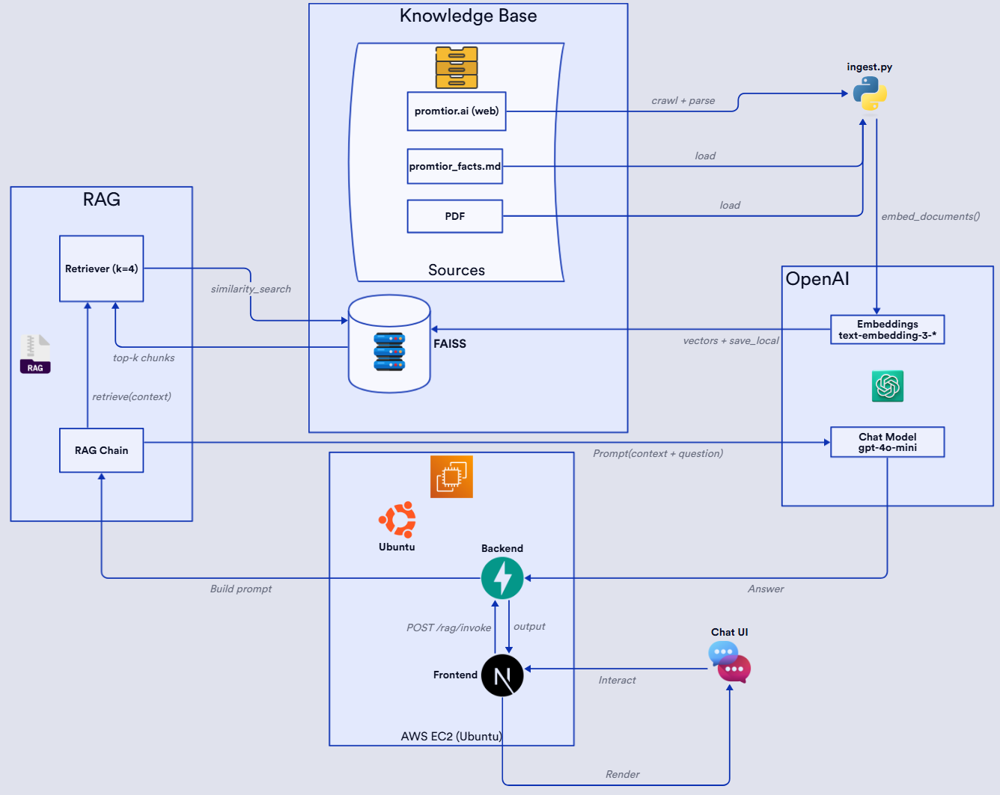

# Promtior RAG Challenge

## Live Link

[http://34.228.22.204:3000/](http://34.228.22.204:3000/) || [http://ec2-34-228-22-204.compute-1.amazonaws.com:3000/](http://ec2-34-228-22-204.compute-1.amazonaws.com:3000/)

## Project Overview
Promtior AI Assistant is a Retrieval-Augmented Generation (RAG) chatbot that can answer questions specifically about Promtior (e.g. “What services does Promtior offer?” and “When was the company founded?”).

The assistant indexes Promtior information (website content, the provided company presentation, and curated company facts) into a vector store, retrieves the most relevant chunks, and uses that as context for the LLM. The model is instructed to only answer using that context.

## Objective
- Provide grounded answers about Promtior using Promtior’s own data.
- Expose that capability as an API.
- Offer a simple chat UI.
- Deploy it in AWS using Terraform.

## Challenges & Solutions
### 1. Preventing hallucinations
**Challenge:** LLMs invent answers if they don't know.  
**Solution:** Retrieval-Augmented Generation (RAG). The chain retrieves the top relevant chunks from Promtior’s knowledge base and the model is forced to answer only using that context. Temperature is set to 0.

### 2. Fragmented company data
**Challenge:** Information about Promtior is split across sources (website, internal presentation, positioning statements).  
**Solution:** A custom ingestion step:
- Load sources (`ingest.py`).
- Split text with a hybrid strategy:
  - Semantic header-based splitting for curated markdown facts (founding date, mission, services).
  - Recursive chunking with overlap for website / PDF text.
- Embed all chunks with OpenAI `text-embedding-3-small`.
- Store everything in a persistent FAISS index.

### 3. Learning + deploying the LangChain stack
**Challenge:** The assistant isn’t just a prompt. It has to run as an API, expose a consistent contract, and be deployable on a server. That means understanding how LangChain, LangServe, FAISS, and FastAPI actually fit together in production.  
**Solution:**  
- Wrapped the retrieval + LLM call as a reusable chain (`rag_chain.py`) and served it through LangServe (`/rag/invoke`).
- Added CORS and a clean JSON interface so a separate frontend can call it.
- Validated that the same chain can run locally and can also be started on an AWS EC2 instance with environment variables and no code changes.

## Architecture Diagram
[](https://d2studio.ai/diagrams/812192233)
<p align="center">
  <a href="https://d2studio.ai/diagrams/812192233">View interactive diagram</a>
</p>

## Tech Stack
**Retrieval & LLM**
- LangChain / LangServe
- OpenAI (embeddings + chat model)
- FAISS

**Backend**
- Python, FastAPI, Uvicorn

**Frontend**
- Next.js (App Router), React, TailwindCSS

**Infra**
- AWS EC2
- Environment variables for secrets (OpenAI key, model, etc.)

## How to Run Locally
Backend:
```bash
cd backend
# set OPENAI_API_KEY in .env
pip install -r requirements.txt
python ingest.py
uvicorn app:app --port 8000
```

Frontend:
```bash
cd frontend
echo "NEXT_PUBLIC_BACKEND_URL=http://localhost:8000" > .env.local
npm install
npm run dev
```
Then open http://localhost:3000
